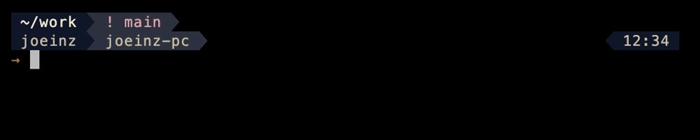

<div align="center">

# InZsh

**“inz-ze-shell”**

A calm, configurable zsh prompt — built from a design system,
with prayer times computed on your machine.

[](https://github.com/joeloudjinz/inzsh/actions/workflows/ci.yml)
[](LICENSE)
[](https://github.com/joeloudjinz/inzsh/releases)


</div>

> **Status: pre-release.** Development is in progress and the interface may change without
> notice until 1.0.

## Why another zsh theme

- **Built from a design system**, not assembled from colours that happened to look nice. Every
  colour is a semantic role with a verified contrast ratio in both light and dark.
- **Prayer times in the prompt** — computed locally, no network, no dependencies beyond zsh.
- **Actually tested.** Unit, render, terminal-grid and visual-regression suites, across zsh
  versions and colour depths.

## Requirements

- zsh **5.8+**
- A [Nerd Font](https://nerdfonts.com) — the prompt uses powerline separators
- A supported terminal (below)

Optional: [oh-my-zsh](https://ohmyz.sh). The theme works with or without it.

## Install

```zsh
git clone https://github.com/joeloudjinz/inzsh.git ~/.inzsh
cd ~/.inzsh && zsh install.zsh
```

Idempotent, backs up your `.zshrc` first, and `--uninstall` takes everything back out — the
[install guide](docs/install.md) covers both paths, requirements and uninstall.

## Presets

| Preset | Mode | For |
|---|---|---|
| `inzsh-sharp` | dark | the default |
| `inzsh-warm` | light | warmer, editorial |

Pick one in `.zshrc`, above the line that sources the theme:

```zsh
INZSH_PRESET=warm
```

**Match the preset to your terminal's background** — `sharp` on a dark one, `warm` on a light
one. A light register on a black background reads as washed-out blocks floating in the dark,
which is the single most common reason the theme looks wrong. Two neighbours matter nearly as
much: a pure-black background leaves the dark register's surfaces little room to separate, and
the Nerd Font variant decides whether the ribbon looks solid — the small-line-gap variants
(`MesloLGS`, not `MesloLGL`) stack without seams.

Read when the theme loads rather than at each prompt — the [configuration
reference](docs/configuration.md) says why. In a shell that is already running:

```zsh
inzsh preset warm     # or 'sharp'; 'inzsh preset' alone says which is in force
```

## The looks

**Sharp** — dark, full colour. The default.


**Warm** — light, editorial.


**256 colours** — what macOS Terminal.app shows. Deliberately pictured: the palette is
hand-tuned for this case and holds the theme's shape, but it is close rather than identical.


**Prayer times** — the segment as the subject, in the one-line shape.


**Rows** — rank places a block along a row; `INZSH_ROW<N>_LEFT` and `INZSH_ROW<N>_RIGHT` say
which row it draws on. Here the path and the branch keep the first row, and who you are takes
the second with the clock at the end of it.



Every still and recording here is generated from fixtures and written straight into
`docs/assets` — `make shots` rebuilds the stills, `make demo` rebuilds the recordings and
publishes the two the docs embed. Nothing is hand-edited or hand-copied.

**Each capture is published at two sizes, and both are real renders.** An animated GIF cannot
go through a website's image pipeline — that pipeline decodes one frame and re-encodes it as a
still — so the only sizes a browser can be offered are the ones rendered here. The bare name is
the size that was published first (2000px wide for the recordings, 1000px for the stills) and
the other rung carries its rendered width: `showcase-1000.gif`, `shot-sharp-2000.png`. Neither
is resampled from the other. `SCALE=2` still applies to the tapes that only land in `demo-out/`.

Renders are reproducible in geometry and content, not byte for byte: the tapes drive a live
pty, so the exact frame a still is cut from — and the frame timing inside a GIF — vary a little
between runs. Two renders of the same tape compare at SSIM 0.9999, which is the cursor blink
landing differently, not the prompt drawing differently.

## Supported terminals

| Environment | Notes |
|---|---|
| Ghostty · iTerm2 · kitty · Alacritty · WezTerm | Full colour. The design target. |
| macOS Terminal.app | 256 colours only; the palette is tuned for this, but it is not identical. |
| tmux | Requires RGB passthrough, or colours are downgraded — see below. |

**tmux setup.** Add to `~/.tmux.conf`:

```tmux
set -sa terminal-features ',*:RGB'
```

Linux TTY and other bare consoles are not supported yet.

## Prayer times

The segment is optional and off unless configured. Times are computed on your machine using
standard astronomical methods — several calculation conventions and both Asr schools are
supported. [How the prayer times are calculated](docs/prayer-times.md) explains the arithmetic
in plain terms and links the published source for every part of it.

```zsh
INZSH_SALAH_LAT=21.4225      # your latitude
INZSH_SALAH_LON=39.8262      # your longitude
INZSH_SALAH_METHOD=mwl       # calculation convention
INZSH_SALAH_ASR=shafi        # Asr school — or hanafi
```

## Privacy

No telemetry. No network calls by default — prayer times are computed locally.

One exception, opt-in and off unless you enable it: `INZSH_SALAH_AUTOLOCATE=1` permits a query
to a third-party IP geolocation service to determine your location, which means your IP address
is sent to that service. Even then the theme never makes the request on its own — you run
`inzsh locate` when you want the stored position refreshed. Setting your coordinates manually
avoids all of this entirely. The precise statement of what leaves the machine is in
[known limitations, privacy and colour accessibility](docs/limitations.md).

## Colour accessibility

**No state is signalled by colour alone** — each carries a glyph, so the prompt reads the same
in monochrome. That one is enforced by the test suite. Contrast was designed to WCAG AA pair by
pair when the palette was built, with the ratios written down beside the colours in the token
layer; that part is recorded design work rather than an automated check. What is and is not
verified is stated exactly in
[known limitations, privacy and colour accessibility](docs/limitations.md).

## Something looks wrong?

Run the built-in diagnostic and paste its output into the issue:

```zsh
inzsh doctor
```

One block covering the InZsh version, how it was installed and from where, zsh version,
terminal, `$TERM`, colour depth, locale, Nerd Font and tmux — everything the bug template asks
for, and nothing private: your coordinates, if the prayer segment has any, are never printed,
and the theme's own path is printed with your home directory collapsed to `~`.

It also answers the quieter failure. A setting the theme cannot read is dropped rather than
obeyed, so that a typo can never stop the prompt drawing — and the doctor lists each one that
was, with what it accepts:

```
ignored       INZSH_SEPARATOR_STYLE=rounded - accepts arrow · round · divider
```

The prayer segment gets two rows of its own, `location:` and `table:` — what each value and each
state of the table means, and what to do about it, is in
[Diagnosing it — `inzsh doctor`](docs/configuration.md#diagnosing-it--inzsh-doctor).

## Contributing

Issues are welcome. Pull requests are considered case-by-case — see
[CONTRIBUTING.md](CONTRIBUTING.md).

## Credits

The segment-rank idea — one integer per segment controlling both order and visibility — comes
from [comfyline](https://gitlab.com/imnotpua/comfyline_prompt) by *not pua*. InZsh is an
independent implementation.

## License

MIT — see [LICENSE](LICENSE).
