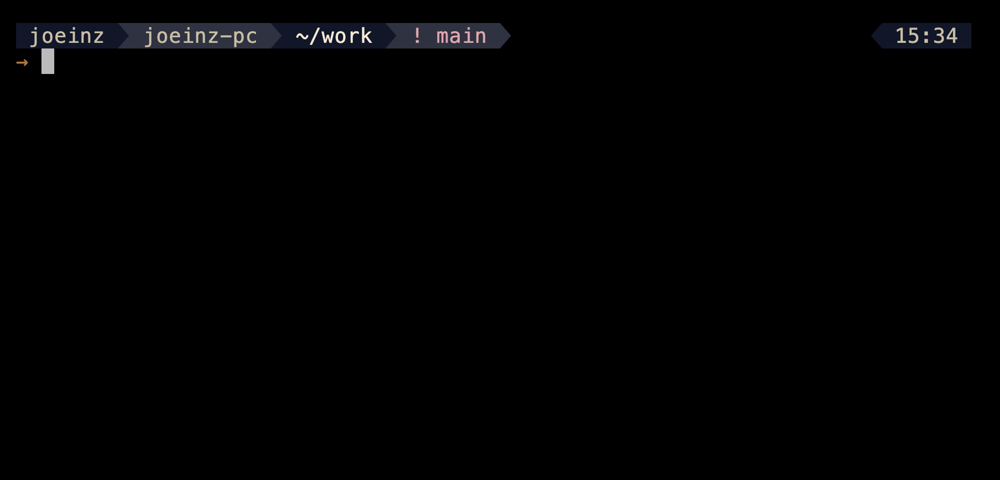
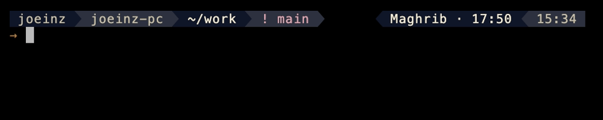
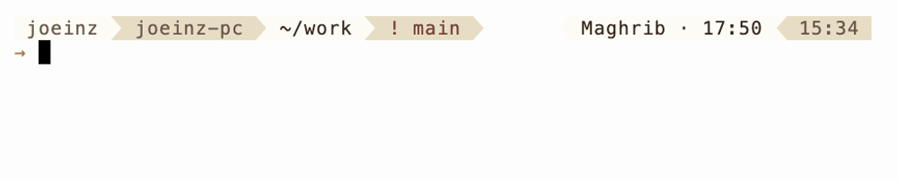
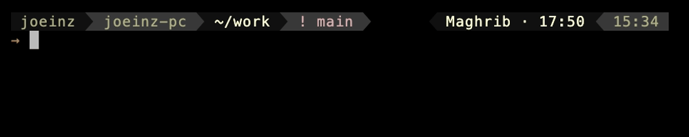
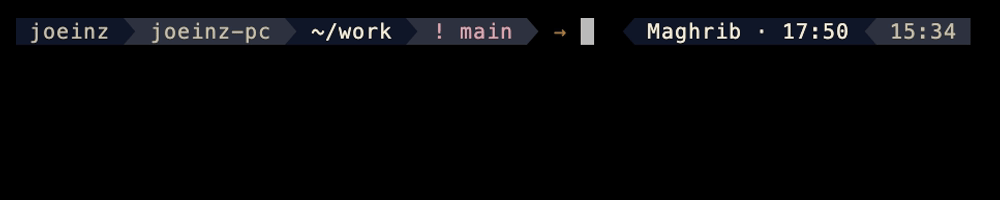

<div align="center">

# InZsh

**“inz-ze-shell”**

A calm, configurable zsh prompt — built from a design system,
with prayer times computed on your machine.

[](https://github.com/joeloudjinz/inzsh/actions/workflows/ci.yml)
[](LICENSE)
[](https://github.com/joeloudjinz/inzsh/releases)




</div>

> **Status: pre-release.** Development is in progress and the interface may change without
> notice until 1.0.

## Why another zsh theme

- **Built from a design system**, not assembled from colours that happened to look nice. Every
  colour is a semantic role with a verified contrast ratio in both light and dark.
- **Prayer times in the prompt** — computed locally, no network, no dependencies beyond zsh.
- **Actually tested.** Unit, render, terminal-grid and visual-regression suites, across zsh
  versions and colour depths.

## Requirements

- zsh **5.8+**
- A [Nerd Font](https://nerdfonts.com) — the prompt uses powerline separators
- A supported terminal (below)

Optional: [oh-my-zsh](https://ohmyz.sh). The theme works with or without it.

## Install

```zsh
git clone https://github.com/joeloudjinz/inzsh.git ~/.inzsh
cd ~/.inzsh && zsh install.zsh
```

Idempotent, backs up your `.zshrc` first, and `--uninstall` takes everything back out — the
[install guide](docs/install.md) covers both paths, requirements and uninstall.

## Presets

| Preset | Mode | For |
|---|---|---|
| `inzsh-sharp` | dark | the default |
| `inzsh-warm` | light | warmer, editorial |

Pick one in `.zshrc`, above the line that sources the theme:

```zsh
INZSH_PRESET=warm
```

Read when the theme loads rather than at each prompt — the [configuration
reference](docs/configuration.md) says why. In a shell that is already running:

```zsh
inzsh preset warm     # or 'sharp'; 'inzsh preset' alone says which is in force
```

## The looks

**Sharp** — dark, full colour. The default.



**Warm** — light, editorial.



**256 colours** — what macOS Terminal.app shows. Deliberately pictured: the palette is
hand-tuned for this case and holds the theme's shape, but it is close rather than identical.



**Prayer times** — the segment as the subject, in the one-line shape.



Every still and recording here is generated from fixtures and written straight into
`docs/assets` — `make shots` rebuilds the four stills, `make demo` rebuilds the recordings and
publishes the showcase. Nothing is hand-edited or hand-copied. `SCALE=2` on either renders the
same tapes at twice the size for a high-DPI screen.

## Supported terminals

| Environment | Notes |
|---|---|
| Ghostty · iTerm2 · kitty · Alacritty · WezTerm | Full colour. The design target. |
| macOS Terminal.app | 256 colours only; the palette is tuned for this, but it is not identical. |
| tmux | Requires RGB passthrough, or colours are downgraded — see below. |

**tmux setup.** Add to `~/.tmux.conf`:

```tmux
set -sa terminal-features ',*:RGB'
```

Linux TTY and other bare consoles are not supported yet.

## Prayer times

The segment is optional and off unless configured. Times are computed on your machine using
standard astronomical methods — several calculation conventions and both Asr schools are
supported.

```zsh
INZSH_SALAH_LAT=21.4225      # your latitude
INZSH_SALAH_LON=39.8262      # your longitude
INZSH_SALAH_METHOD=mwl       # calculation convention
INZSH_SALAH_ASR=shafi        # Asr school — or hanafi
```

## Privacy

No telemetry. No network calls by default — prayer times are computed locally.

One exception, opt-in and off unless you enable it: `INZSH_SALAH_AUTOLOCATE=1` permits a query
to a third-party IP geolocation service to determine your location, which means your IP address
is sent to that service. Even then the theme never makes the request on its own — you run
`inzsh locate` when you want the stored position refreshed. Setting your coordinates manually
avoids all of this entirely. The precise statement of what leaves the machine is in
[known limitations, privacy and colour accessibility](docs/limitations.md).

## Colour accessibility

Every foreground/background pairing is verified against WCAG AA, in both presets and at both
colour depths. The palette is checked under protanopia, deuteranopia and tritanopia simulation,
and no state is signalled by colour alone — each carries a glyph. The scope of that claim —
and what it deliberately does not cover — is stated in
[known limitations, privacy and colour accessibility](docs/limitations.md).

## Something looks wrong?

Run the built-in diagnostic and paste its output into the issue:

```zsh
inzsh doctor
```

One block covering zsh version, terminal, `$TERM`, colour depth, locale, Nerd Font and tmux —
everything the bug template asks for, and nothing private: your coordinates, if the prayer
segment has any, are never printed.

It also answers the quieter failure. A setting the theme cannot read is dropped rather than
obeyed, so that a typo can never stop the prompt drawing — and the doctor lists each one that
was, with what it accepts:

```
ignored       INZSH_SEPARATOR_STYLE=rounded - accepts arrow · round · divider
```

## Contributing

Issues are welcome. Pull requests are considered case-by-case — see
[CONTRIBUTING.md](CONTRIBUTING.md).

## Credits

The segment-rank idea — one integer per segment controlling both order and visibility — comes
from [comfyline](https://gitlab.com/imnotpua/comfyline_prompt) by *not pua*. InZsh is an
independent implementation.

## License

MIT — see [LICENSE](LICENSE).
